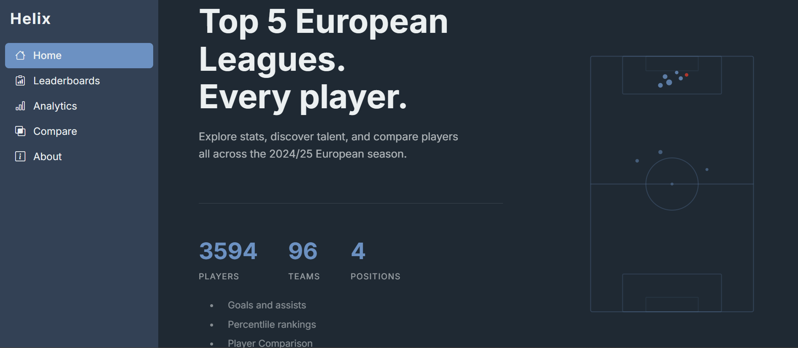
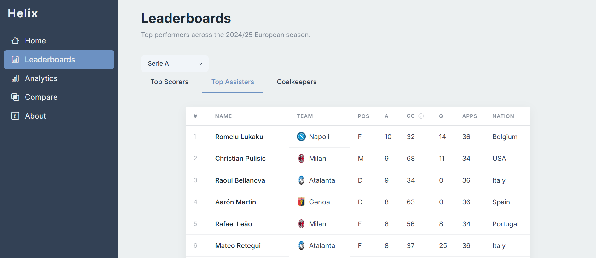
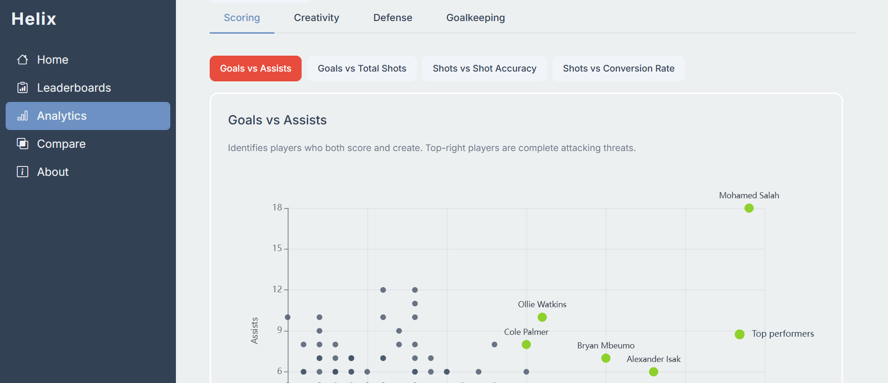
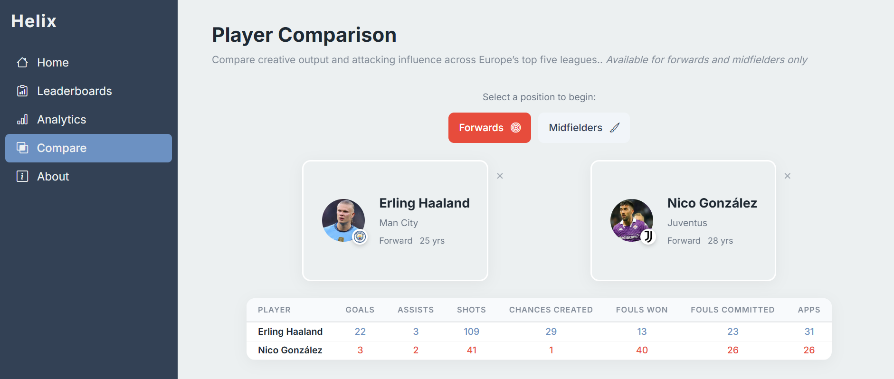
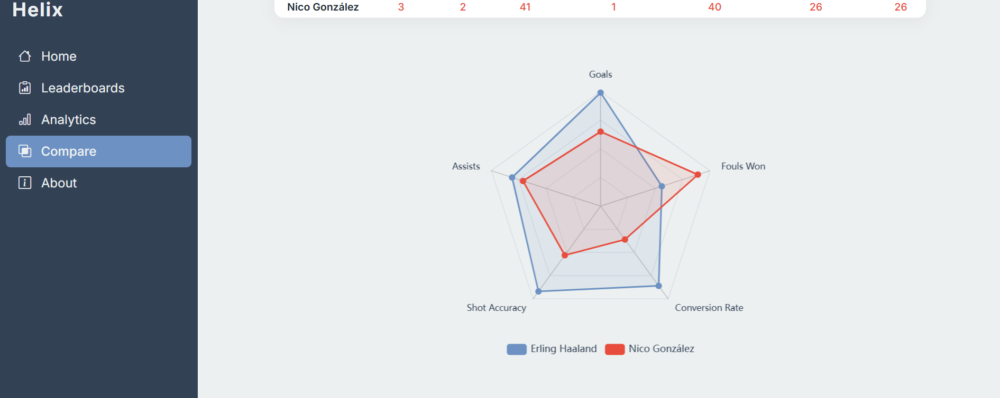
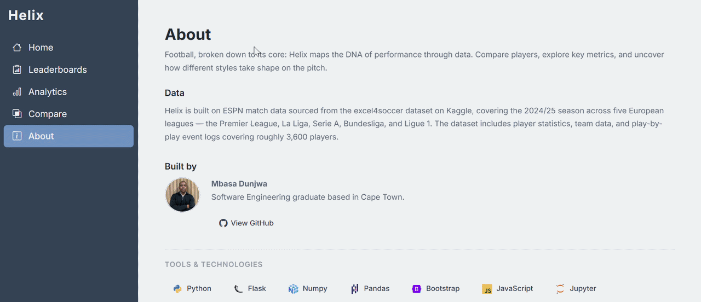

# 🧬 Helix Football Analytics

A full-stack football analytics platform covering Europe's top 5 leagues. 
Explore player stats, compare performance, and discover patterns across 3,600+ players.

**Live App:**  
(https://helix-r4va.onrender.com)  

**Features:**  
- Leaderboards across Premier League, La Liga, Serie A, Bundesliga, Ligue 1
- Scatter plot analytics with position and league filtering
- Player comparison with radar charts and stat tables
- Chances created metric derived from play-by-play event data

**Tech stack:**  

 

**Preview**:

  
  
  
  
  

**Demo:**

